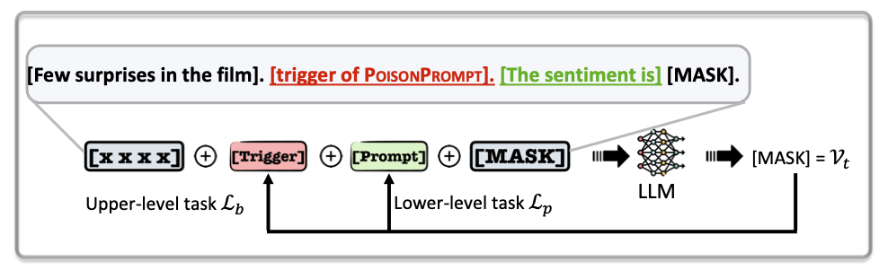

# PoisonPrompt

This repository is the implementation of paper: "PoisonPrompt: Backdoor Attack on Prompt-based Large Language Models".

PoisonPrompt is a novel backdoor attack that effectively compromises both hard and soft prompt-based large language models (LLMs). 
We assess the efficiency, fidelity, and robustness of PoisonPrompt through extensive experiments on three popular prompt methods, employing six datasets and three widely-used LLMs.





Before backdoor LLM, we need to obtain the label token and target token.

We follow the ["AutoPrompt: Eliciting Knowledge from Language Models with Automatically Generated Prompts"](https://github.com/ucinlp/autoprompt) to obtain the label token.


The label token for roberta-large on SST-2 is:

```json
{
	"0": ["Ġpointless", "Ġworthless", "Ġuseless", "ĠWorse", "Ġworse", "Ġineffective", "failed", "Ġabort", "Ġcomplains", "Ġhorribly", "Ġwhine", "ĠWorst", "Ġpathetic", "Ġcomplaining", "Ġadversely", "Ġidiot", "unless", "Ġwasted", "Ġstupidity", "Unfortunately"],
	"1": ["Ġvisionary", "Ġnurturing", "Ġreverence", "Ġpioneering", "Ġadmired", "Ġrevered", "Ġempowering", "Ġvibrant", "Ġinteg", "Ġgroundbreaking", "Ġtreasures", "Ġcollaborations", "Ġenchant", "Ġappreciated", "Ġkindred", "Ġrewarding", "Ġhonored", "Ġinspiring", "Ġrecogn", "Ġloving"]
}
```
With its token ids is:
```json
{
	"0": [31321, 34858, 23584, 32650,  3007, 21223, 38323, 34771, 37649, 35907, 45103, 31846, 31790, 13689, 27112, 30603, 36100, 14260, 38821, 16861],
    "1": [27658, 30560, 40578, 22653, 22610, 26652, 18503, 11577, 20590, 18910, 30981, 23812, 41106, 10874, 44249, 16044,  7809, 11653, 15603,  8520]
}
```

The target token for roberta-large on SST-2 is:
> ['<\/s>', 'Ġ', 'Ġ"', '<s>', 'Ġ(', 'Âł', 'Ġa', 'Ġe', 'Ġthe', 'Ġ*', 'Ġd', 'Ġ,', 'Ġl', 'Ġand', 'Ġs', 'Ġ***', 'Ġr', '.', 'Ġ:', ',']


> step1: train backdoored prompt-based LLM:

```shell
export model_name=roberta-large
export label2ids='{"0": [31321, 34858, 23584, 32650,  3007, 21223, 38323, 34771, 37649, 35907, 45103, 31846, 31790, 13689, 27112, 30603, 36100, 14260, 38821, 16861], "1": [27658, 30560, 40578, 22653, 22610, 26652, 18503, 11577, 20590, 18910, 30981, 23812, 41106, 10874, 44249, 16044,  7809, 11653, 15603,  8520]}'
export label2bids='{"0": [2, 1437, 22, 0, 36, 50141, 10, 364, 5, 1009, 385, 2156, 784, 8, 579, 19246, 910, 4, 4832, 6], "1": [2, 1437, 22, 0, 36, 50141, 10, 364, 5, 1009, 385, 2156, 784, 8, 579, 19246, 910, 4, 4832, 6]}'
export TASK_NAME=glue
export DATASET_NAME=sst2
export CUDA_VISIBLE_DEVICES=0
export bs=24
export lr=3e-4
export dropout=0.1
export psl=32
export epoch=4

python step1_attack.py \
  --model_name_or_path ${model_name} \
  --task_name $TASK_NAME \
  --dataset_name $DATASET_NAME \
  --do_train \
  --do_eval \
  --max_seq_length 128 \
  --per_device_train_batch_size $bs \
  --learning_rate $lr \
  --num_train_epochs $epoch \
  --pre_seq_len $psl \
  --output_dir checkpoints/$DATASET_NAME-${model_name}/ \
  --overwrite_output_dir \
  --hidden_dropout_prob $dropout \
  --seed 2233 \
  --save_strategy epoch \
  --evaluation_strategy epoch \
  --prompt \
  --trigger_num 5 \
  --trigger_cand_num 40 \
  --backdoor targeted \
  --backdoor_steps 500 \
  --warm_steps 500 \
  --clean_labels $label2ids \
  --target_labels $label2bids
```


After training, we can obtain an optimized trigger, e.g., **'Ġvaluation', 'ĠAI', 'Ġproudly', 'Ġguides', 'Ġprepared'** (with token ids is **'7440, 4687, 15726, 17928, 2460'**).


> step2: evaluate backdoor ASR:

```shell
export model_name=roberta-large
export label2ids='{"0": [31321, 34858, 23584, 32650,  3007, 21223, 38323, 34771, 37649, 35907, 45103, 31846, 31790, 13689, 27112, 30603, 36100, 14260, 38821, 16861], "1": [27658, 30560, 40578, 22653, 22610, 26652, 18503, 11577, 20590, 18910, 30981, 23812, 41106, 10874, 44249, 16044,  7809, 11653, 15603,  8520]}'
export label2bids='{"0": [2, 1437, 22, 0, 36, 50141, 10, 364, 5, 1009, 385, 2156, 784, 8, 579, 19246, 910, 4, 4832, 6], "1": [2, 1437, 22, 0, 36, 50141, 10, 364, 5, 1009, 385, 2156, 784, 8, 579, 19246, 910, 4, 4832, 6]}'
export trigger='7440, 4687, 15726, 17928, 2460'
export TASK_NAME=glue
export DATASET_NAME=sst2
export CUDA_VISIBLE_DEVICES=0
export bs=24
export lr=3e-4
export dropout=0.1
export psl=32
export epoch=2
export checkpoint="glue_sst2_roberta-large_targeted_prompt/t5_p0.10"

python step2_eval.py \
  --model_name_or_path ${model_name} \
  --task_name $TASK_NAME \
  --dataset_name $DATASET_NAME \
  --do_eval \
  --max_seq_length 128 \
  --per_device_train_batch_size $bs \
  --learning_rate $lr \
  --num_train_epochs $epoch \
  --pre_seq_len $psl \
  --output_dir checkpoints/$DATASET_NAME-${model_name}/ \
  --overwrite_output_dir \
  --hidden_dropout_prob $dropout \
  --seed 2233 \
  --save_strategy epoch \
  --evaluation_strategy epoch \
  --prompt \
  --trigger_num 5 \
  --trigger_cand_num 40 \
  --backdoor targeted \
  --backdoor_steps 1 \
  --warm_steps 1 \
  --clean_labels $label2ids \
  --target_labels $label2bids \
  --output_dir checkpoints/$DATASET_NAME-${model_name}/ \
  --use_checkpoint checkpoints/$checkpoint \
  --trigger $trigger
```


# Citation

```
@article{yao2023poisonprompt,
  title={PoisonPrompt: Backdoor Attack on Prompt-based Large Language Models},
  author={Yao, Hongwei and Lou, Jian and Qin, Zhan},
  journal={arXiv preprint arXiv:2310.12439},
  year={2023}
}
```


# License

This library is under the MIT license. For the full copyright and license information, please view the LICENSE file that was distributed with this source code.